<div align="center">


<h1>Hi there, I'm Hướng MT. 👋</h1>
<h3>Frontend Developer · React & Flutter Specialist 🚀</h3>

<br/>

[](https://git.io/typing-svg)

<br/>

[](https://portfolio-rho-one-stlaswaxzm.vercel.app/)
[](https://www.linkedin.com/in/h%C6%B0%E1%BB%9Bng-mt-9b04a8345)
[](https://facebook.com/huongmt-0909)
[](mailto:huongmt.0909@gmail.com)

</div>


## 👨‍💻 About Me

```ts
const huongMT = {
  name:      "Ma Trung Hướng",
  alias:     "Hướng MT.",
  role:      "Frontend Developer",
  location:  "Vietnam 🇻🇳",
  company:   "Bunbu Software (2022 → now)",
  focus:     ["ReactJS", "Flutter", "TypeScript"],
  email:     "huongmt.0909@gmail.com",
  website:   "https://portfolio-rho-one-stlaswaxzm.vercel.app/",
  available:  true,
};
```


## 🛠 Tech Stack





## 📊 GitHub Stats

<div align="center">
  
  
</div>

<div align="center">
  
</div>


## 🏆 Trophy

<div align="center">
  
</div>


## 🐍 Contribution Snake

<div align="center">
  <picture>
    <source media="(prefers-color-scheme: dark)" srcset="https://raw.githubusercontent.com/huongmt0909/huongmt0909/output/snake-dark.svg" />
    <source media="(prefers-color-scheme: light)" srcset="https://raw.githubusercontent.com/huongmt0909/huongmt0909/output/snake.svg" />
    
  </picture>
</div>


<div align="center">


<br/><br/>

*"Code is like humor. When you have to explain it, it's bad."*

</div>
